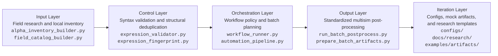

# alpha-research-workflow

Public, sanitized workflow for alpha research with expression validation, batch post-processing, failure diagnosis, and experiment iteration support.

> This repository is not a notebook dump. It packages alpha research into a repeatable engineering loop: `research -> expression drafting -> local validation -> batch processing -> failure diagnosis -> next-round action`.

## Why This Repository Matters

- Converts alpha research from ad hoc trial-and-error into a structured workflow
- Validates expressions locally before expensive platform-side simulation
- Standardizes multisim outputs into reusable artifacts for analysis and iteration
- Preserves research memory so future rounds do not repeat the same failed branch

## Platform Achievements

### 1. Submitted Alphas Distribution


### 2. OS Alphas Status and PowerPool Selection


These screenshots are included to show that the workflow is tied to real platform-side alpha submission, OS monitoring, and production-facing iteration rather than purely local scripting.

## System Architecture



### Minimal Closed Loop

- Input layer: field research, local inventory shaping, and field catalog normalization
- Control layer: expression syntax validation, operator compatibility checks, and fingerprint-based structural comparison
- Output layer: multisim collection, standardized artifact generation, and post-process summaries
- Iteration layer: next-round planning, failure classification, and reusable research-memory templates

## What The Repository Contains

| Area | Files | Purpose |
|---|---|---|
| Workflow core | `workflow_runner.py`, `automation_pipeline.py` | Heuristics, batch planning, next-round action selection, CLI entrypoints |
| Validation | `expression_validator.py`, `expression_fingerprint.py` | Parser, AST, operator checks, fingerprint extraction, structural comparison |
| Result filtering | `filter_wq_alphas.py` | Threshold-based alpha summaries and platform-check filtering |
| Artifact handling | `prepare_batch_artifacts.py`, `run_batch_postprocess.py` | Standard layout creation and batch post-processing |
| Local research assets | `configs/`, `docs/`, `examples/` | Public-safe templates, workflow notes, mock inputs, mock artifacts |
| Legacy reference | `legacy_direct_api/` | Archived direct-API utilities kept for reference only |

## End-to-End Workflow

1. Start from a research hypothesis and map it to candidate fields.
2. Draft a small batch of expressions with explicit economic rationale.
3. Run local preflight to catch syntax, scope, and compatibility issues early.
4. Collect multisim outputs into a standardized artifact layout.
5. Diagnose results using failure modes such as:
   - `LOW_SUB_UNIVERSE_SHARPE`
   - `LOW_2Y_SHARPE` / `IS_LADDER_SHARPE`
   - `PROD_CORRELATION`
   - `SELF_CORRELATION`
   - concentration and turnover issues
6. Restrict the next round to one primary action instead of blind parameter grinding.

## Repository Structure

```text
.
|-- README.md
|-- requirements.txt
|-- workflow_runner.py
|-- automation_pipeline.py
|-- expression_validator.py
|-- expression_fingerprint.py
|-- filter_wq_alphas.py
|-- prepare_batch_artifacts.py
|-- run_batch_postprocess.py
|-- alpha_inventory_builder.py
|-- field_catalog_builder.py
|-- operators.json
|-- configs/
|-- docs/
|-- examples/
`-- legacy_direct_api/
```

## Example Commands

### 1. Generate a workflow snapshot

```bash
python automation_pipeline.py snapshot --config configs/eur_analyst_workflow_config.json
```

### 2. Run local preflight on candidate expressions

```bash
python automation_pipeline.py preflight --config configs/eur_analyst_workflow_config.json --expressions your_candidates.json --report-out preflight_report.json
```

### 3. Initialize a standard batch artifact directory

```bash
python automation_pipeline.py init-batch --config configs/eur_analyst_workflow_config.json --artifact-root batch_artifacts --round-name demo_round --multisim-id YOUR_MULTISIM_ID
```

### 4. Post-process a collected batch

```bash
python automation_pipeline.py process-batch --config configs/eur_analyst_workflow_config.json --batch-dir batch_artifacts/demo_round__YOUR_MULTISIM_ID
```

## Public Examples Included

- `examples/inputs/`: public-safe mock candidate and preflight inputs
- `examples/artifacts/public_batch_demo__MULTISIM_PLACEHOLDER/`: public-safe mock batch artifact directory showing:
  - `multisim_children.json`
  - `alpha_details/`
  - `batch_payload.json`
  - `postprocess_status.json`
  - `manifest.json`
- `docs/research/`: public-safe research-memory templates and note formats

These assets preserve the workflow shape without exposing private alpha content, private batch logs, or private platform records.

## Dependencies

External Python dependencies are intentionally minimal:

- `pandas`
- `requests`

Install with:

```bash
pip install -r requirements.txt
```

## Public Release Scope

This GitHub version is intentionally sanitized. It removes or replaces:

- local credentials
- generated inventories
- private field catalog dumps
- large private batch artifacts
- private optimization logs
- private research notes and real alpha expressions
- private account identifiers and non-public batch metadata

Ignored runtime outputs are defined in `.gitignore`.

## Limitations

- Some legacy scripts still assume a local `credential.txt` when using direct API flows.
- The repository is designed for code review, portfolio presentation, and architecture discussion rather than as a drop-in production environment.
- Example data is illustrative, sanitized, and intentionally incomplete.
